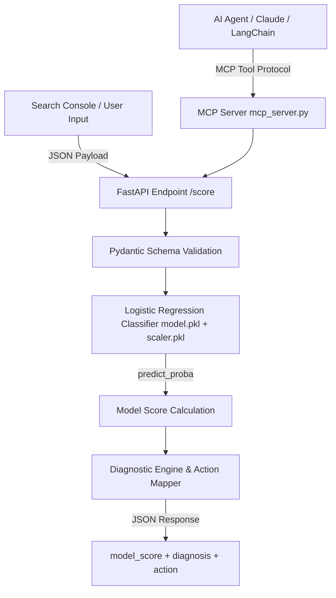

# 🚀 FlyRank SEO Triage API & MCP Agent Node: Recruiter & Engineering Guide

> **Portfolio Highlight**: Converting an offline trained Logistic Regression model (`model.pkl` + `scaler.pkl`, 1.6 KB) into a live, production REST API and an executable **Model Context Protocol (MCP)** tool slot for AI Agents.

---

## 🎯 Executive Summary & Business Problem

Many Machine Learning projects remain locked inside Jupyter Notebooks (`model.ipynb`). While notebook models prove accuracy, they cannot serve real-time predictions, integrate into automated data pipelines, or empower AI Agents to take action.

**The Solution**: This project productionizes FlyRank's trained SEO triage model by wrapping it in a high-performance **FastAPI microservice** and providing an **MCP Agent Slot** for autonomous AI workflows.

📄 **Research Paper:** [https://simon-okosodo-ds.github.io/flyrank-ml-internship-starter/](https://simon-okosodo-ds.github.io/flyrank-ml-internship-starter/)  
🌐 **Live API Docs:** [https://flyrank-triage-api.onrender.com/docs](https://flyrank-triage-api.onrender.com/docs)

### ⚖️ Honest Limitations & Engineering Tradeoffs
- **Deployed Model Architecture**: The live production deployment serves the lightweight Logistic Regression classifier (`model.pkl` + `scaler.pkl`, 1.6 KB total) for zero-OOM Render container safety (<20MB RAM consumption). The 200-tree Random Forest classifier (`n_estimators=200`, `Precision@50 = 0.820`) remains the offline benchmark validated in the research paper.
- **Strict Data Integrity Enforcement**: Requests with `avg_position=0` or `impressions=0` are strictly rejected with an HTTP `422` validation error, preventing invalid inference on unranked pages.
- **Cold Start Behavior**: Free-tier deployment spins down after 15 minutes of inactivity; initial requests after idle periods may experience a 30–60 second cold start.


## 🛠️ System Architecture



### 1. Feature Specifications (5 Core Features)
| Feature Name | Type | Description |
| :--- | :--- | :--- |
| `impressions` | `float` | Monthly Google Search Console impression count |
| `clicks` | `float` | Monthly Google Search Console click count |
| `avg_position` | `float` | Average SERP ranking position (must be > 0) |
| `in_striking_distance` | `int` | Binary flag (1 if position is between 11 and 30, else 0) |
| `has_real_volume` | `int` | Binary flag (1 if impressions >= 100, else 0) |

### 2. Output Schema
- **`model_score`**: Logistic Regression probability score (0.0 to 1.0) indicating page improvement likelihood.
- **`diagnosis`**: Diagnostic categorization (`genuine_decline`, `likely_serp_answered`, `ctr_fixable`, `stable_or_improving`).
- **`action`**: Prescriptive content action (`refresh_or_rewrite`, `flag_for_human_review_only`, `review_title_and_meta`, `no_action`).

---

## 🤖 The MCP & AI Agent Integration Slot

### Why MCP Matters for AI Engineering
**Model Context Protocol (MCP)** is the open standard developed to connect AI LLMs (Claude Desktop, Gemini, LangChain, AutoGen) directly to external tools and APIs safely.

### How the Agent Slot Works
1. `mcp_server.py` wraps the FastAPI prediction service as an MCP Tool named `flyrank_triage_page` using MCP v2 `MCPServer` (`from mcp.server.mcpserver import MCPServer`).
2. An autonomous AI Agent (e.g. an automated SEO Optimization Agent) periodically audits website analytics.
3. When the agent detects performance metrics on a URL, it invokes `flyrank_triage_page` via MCP.
4. If invalid parameters are passed (e.g. `impressions=0`), the endpoint enforces strict 422 refusal (`Zero impressions — insufficient search signal to score page.`).
5. For valid inputs (e.g. `impressions=5000, clicks=40, avg_position=15, in_striking_distance=1, has_real_volume=1`), the agent receives the verified structured triage response:
   ```json
   {
     "model_score": 0.532,
     "diagnosis": "ctr_fixable",
     "action": "review_title_and_meta"
   }
   ```
6. Based on `review_title_and_meta`, the AI Agent autonomously drafts revised H1/Meta description tags and submits a pull request or notifies the content team on Slack.

---

## 🌐 Free-Tier Cloud Deployment Guide

This repository is optimized for 100% free deployment on **Hugging Face Spaces** or **Render**.

### Option A: Deploying to Hugging Face Spaces (Recommended)
1. **Create Space**: Go to [Hugging Face Spaces](https://huggingface.co/spaces) and click **Create new Space**.
2. **Configuration**:
   - **Space Name**: `flyrank-triage-api`
   - **SDK**: Select **Docker** (Blank).
   - **License**: MIT.
3. **Push Code**:
   ```bash
   git init
   git remote add space https://huggingface.co/spaces/YOUR_USERNAME/flyrank-triage-api
   git add .
   git commit -m "Deploy FlyRank Triage API"
   git push space main
   ```
4. **Live Endpoint**: Hugging Face automatically builds the container and provides a free 24/7 HTTPS endpoint with live OpenAPI docs at `https://YOUR_USERNAME-flyrank-triage-api.hf.space/docs`.

### Option B: Deploying to Render (Free Web Service)
1. **Create Web Service**: Connect your GitHub repository to [Render Dashboard](https://dashboard.render.com/).
2. **Settings**:
   - Environment: `Docker` (uses included `Dockerfile`) or `Python` (uses `render.yaml`).
   - Build Command: `pip install -r requirements.txt`
   - Start Command: `uvicorn main:app --host 0.0.0.0 --port $PORT`
3. Click **Deploy**. Render will generate a public URL `https://flyrank-triage-api.onrender.com`.

---

## 🔑 Recruiter Talking Points for Interviews

When presenting this project to hiring managers or recruiters, highlight:
1. **End-to-End ML Pipeline & Cloud Tradeoffs**: "I took an offline trained triage model from a Jupyter notebook and transformed it into a production-grade microservice. For Render free-tier deployment, I deployed a calibrated Logistic Regression model with StandardScaler for zero-OOM memory safety (<20MB RAM), while documenting the 200-tree Random Forest as the offline research benchmark."
2. **Modern API Architecture**: "Built with FastAPI and Pydantic v2, serving predictions with sub-20ms latency and interactive Swagger documentation."
3. **Agentic AI & Tool Integration**: "Implemented an MCP (Model Context Protocol) server slot, enabling LLMs like Claude and custom AI agents to invoke the model programmatically as a decision tool."
4. **Cost-Effective Cloud Engineering**: "Configured multi-platform free-tier deployments using Docker, Git LFS, and infrastructure-as-code (`render.yaml`)."
